# Munch Mate

Plataforma SaaS multi-restaurante para pedidos por **QR en la mesa**, **retiro** y **delivery**, con tablero de cocina en vivo y seguimiento del pedido en tiempo real.

- Qué hace el producto: [README-PRODUCT.md](README-PRODUCT.md)
- Alcance, modelo de datos y hoja de ruta: [docs/PRODUCT.md](docs/PRODUCT.md)
- Stack, reglas y convenciones técnicas: [CLAUDE.MD](CLAUDE.MD)

**Stack:** Next.js · NestJS · Socket.IO · BullMQ + Valkey · MongoDB · Garage (S3) · Caddy · Docker Compose. Todo autoalojado, sin servicios de nube.

---

## Ruta de pruebas desde cero

Todo lo que hay que hacer, en orden, para dejar el sistema corriendo en tu máquina y probarlo como lo usarían el dueño, la cocina, un repartidor y un cliente.

```mermaid
flowchart LR
  subgraph A["1 · Preparar la máquina (una vez)"]
    direction LR
    s1["1 Requisitos"] --> s2["2 pnpm install"] --> s3["3 pnpm env:init"] --> s4["4 Chromium de Playwright"]
  end
  subgraph B["2 · Calidad sin Docker (~2 min)"]
    direction LR
    s5["5 pnpm build"] --> s6["6 pnpm typecheck"] --> s7["7 pnpm test"]
  end
  subgraph C["3 · Integración con Docker (~8 min)"]
    direction LR
    s8["8 pnpm test:int"] --> s9["9 pnpm test:e2e"]
  end
  subgraph D["4 · Release gate local (~6 min)"]
    direction LR
    s10["10 pnpm stack:up"] --> s11["11 pnpm stack:init"] --> s12["12 pnpm smoke"] --> s13["13 pnpm test:web"]
  end
  subgraph E["5 · Demo en el navegador"]
    direction LR
    s14["14 pnpm seed:demo"] --> s15["15 platform:admin"] --> s16["16 Pedir en la mesa"] --> s17["17 Tablero en vivo"] --> s18["18 Retiro y delivery"] --> s19["19 Repartidor"] --> s20["20 Ventas y horario"] --> s21["21 Plataforma"] --> s22["22 pnpm stack:down"]
  end
  A --> B --> C --> D --> E
```



| Recorrido | Pasos |
| --- | --- |
| **Primera vez** | 1 → 22 |
| **Después de un cambio** | 5 · 6 · 7 · 8 · 9 · 10 · 12 · 13 · 22 |
| **Solo mostrar la demo** | 10 · 14 → 22 |
| **Desarrollo diario** | [ver más abajo](#desarrollo-diario) |

> **Windows:** los comandos que ejecutan scripts `sh` (marcados con 🐚: `env:init`, `stack:init`, `smoke`, `platform:admin`, `infra:init`) necesitan **Git Bash**. Si prefieres PowerShell, configura una vez:
> `pnpm config set script-shell "C:\Program Files\Git\bin\bash.exe"`. PowerShell 5.1 tampoco acepta `&&`: ejecuta los comandos uno por línea.

### 1 · Preparar la máquina

<details>
<summary><b>1. Requisitos</b> — Node, pnpm, Docker</summary>

```bash
node -v          # 24 o más nuevo
pnpm -v          # 12.x  (si falta: npm i -g pnpm)
docker version   # Docker Desktop abierto
```

- **Deberías ver:** las tres versiones sin error, y Docker Desktop con «Engine running».
- **Si falla:** abre Docker Desktop y espera a que inicie. Si tienes XAMPP o IIS, detén Apache: el stack necesita los puertos 80 y 443 libres (paso 10).
</details>

<details>
<summary><b>2. Dependencias</b> — <code>pnpm install</code></summary>

```bash
pnpm install
```

- **Deberías ver:** «Done in …».
- **Nota:** el aviso de builds bloqueados es normal; el repo aprueba solo los necesarios (argon2, sharp) en `pnpm-workspace.yaml`.
</details>

<details>
<summary><b>3. Archivo .env</b> 🐚 — <code>pnpm env:init</code></summary>

```bash
pnpm env:init
```

- Crea `.env` desde `.env.example` con secretos aleatorios. Se niega a sobrescribir uno existente.
- **Nunca** subas `.env` a git.
</details>

<details>
<summary><b>4. Navegador de pruebas</b> — Chromium de Playwright</summary>

```bash
pnpm --filter @app/web exec playwright install chromium
```

Descarga Chromium (~150 MB) una sola vez, para las pruebas de la web (paso 13).
</details>

### 2 · Calidad sin Docker

<details>
<summary><b>5–7. Compilar, tipos y unitarios</b></summary>

```bash
pnpm build
pnpm typecheck
pnpm test
```

- **Deberías ver:** ningún `error TS…`, y utils, workers, web y api en «passed».
- **Si falla:** pnpm se detiene en el primer paquete que falla y los siguientes no se ejecutan. Las líneas con `●` o `✕` dicen qué test falló.
</details>

### 3 · Integración con Docker

<details>
<summary><b>8–9. Integración y API end-to-end</b> — Testcontainers</summary>

```bash
pnpm test:int    # repositorios, colas, comprobante en Garage, email en Mailpit
pnpm test:e2e    # todos los endpoints con sesión real y Socket.IO
```

- **Deberías ver:** «Tests: … passed» en api y workers.
- **Si falla:** «Could not find a working container runtime» significa que Docker Desktop no está corriendo. La primera vez descarga las imágenes y tarda más.
</details>

### 4 · Release gate local

Las mismas imágenes que irían al VPS, detrás de Caddy y HTTPS en `https://localhost`.

<details>
<summary><b>10. Levantar el stack</b> — <code>pnpm stack:up</code></summary>

```bash
pnpm infra:down   # solo si tenías el modo desarrollo arriba
pnpm stack:up
```

- **Deberías ver:** los 8 contenedores en «Healthy», y <https://localhost> con la página de inicio (acepta el certificado local).
- **Si falla:** si ves una página de Apache, XAMPP ocupa los puertos 80/443: detenlo y repite.
</details>

<details>
<summary><b>11. Inicializar Garage</b> 🐚 — <code>pnpm stack:init</code> (solo con volúmenes nuevos)</summary>

```bash
pnpm stack:init
```

Crea el layout de Garage, la llave de la app y los buckets (privado y de fotos). Se puede repetir sin problema.
</details>

<details>
<summary><b>12. Smoke test</b> 🐚 — <code>pnpm smoke</code></summary>

```bash
pnpm smoke
```

- Recorre el sistema real: salud, TLS, S3, colas, registro, menú, mesa, retiro, delivery, ventas y plataforma.
- **Deberías ver:** `✓ all checks passed`.
- **Si falla:** copia las líneas con `✗`. Registra 1 usuario: si acabas de correr Playwright, espera 1 minuto (límite de 5 registros por minuto).
</details>

<details>
<summary><b>13. Pruebas de la web</b> — <code>pnpm test:web</code></summary>

```bash
# espera ~1 minuto después del smoke
pnpm test:web
pnpm --filter @app/web exec playwright show-report   # si algo falla
```

Playwright maneja un Chromium móvil contra `https://localhost`: cuentas, menú, mesa, retiro, delivery y horario.
</details>

### 5 · Demo en el navegador

<details>
<summary><b>14. Cargar la demo</b> — <code>pnpm seed:demo</code></summary>

```bash
pnpm seed:demo
```

Crea 3 locales con menú, fotos, mesas, retiro y zonas de delivery, usando la API como lo haría un usuario. Imprime un link `/m/…` para pedir desde una mesa de cada local.

**Cuenta:** `demo@munchmate.local` / `munchmate demo 2026`
</details>

<details>
<summary><b>15. Hacerte administrador de plataforma</b> 🐚</summary>

```bash
pnpm platform:admin demo@munchmate.local
pnpm platform:admin --revoke demo@munchmate.local   # para quitarlo
```
</details>

<details>
<summary><b>16–21. Probar cada rol</b></summary>

| # | Rol | Qué hacer | Deberías ver |
| --- | --- | --- | --- |
| 16 | Cliente en la mesa | Abre el link `/m/…` del seed en el teléfono o en incógnito y envía un pedido | `/pedido` con el número grande y «Pendiente» |
| 17 | Dueño / cocina | Entra a <https://localhost/admin> → **Pedidos**, activa el sonido y acepta | El pedido aparece sin recargar; el cliente ve el cambio en vivo |
| 18 | Cliente online | En <https://localhost/r/pizzeria-forno-rosso> pide para **retiro** o **delivery** (efectivo con vuelto), con un email inventado | Al aceptar: «Listo / Llega aprox. a las HH:MM» y el email con el PDF en [Mailpit](http://localhost:8025) |
| 19 | Repartidor | En **Equipo** invita un email con rol Repartidor, acepta desde Mailpit en otra ventana y asígnale un delivery | Solo ve sus entregas: sale a repartir, cobra con el vuelto a la vista y entrega |
| 20 | Dueño / caja | Abre **Ventas**; en **Resumen** configura un horario que deje el local cerrado | Totales del día; el menú dice «Cerrado ahora · Abre … a las HH:MM» |
| 21 | Platform admin | Menú del usuario → **Plataforma**, suspende un local y luego reactívalo | Suspendido: su menú público desaparece y el panel queda en solo lectura |
</details>

<details>
<summary><b>22. Apagar</b> — <code>pnpm stack:down</code></summary>

```bash
pnpm stack:down
```

Detiene los contenedores y conserva los datos en los volúmenes. Si detuviste XAMPP, ya puedes volver a iniciarlo.
</details>

---

## Desarrollo diario

Infra en Docker y apps en tu máquina con hot reload. Comparte volúmenes con el stack de producción, pero **no pueden correr a la vez**.

```bash
pnpm stack:down      # si estaba arriba
pnpm infra:up        # mongo, valkey, garage y mailpit en 127.0.0.1
pnpm infra:init      # 🐚 solo con volúmenes nuevos
pnpm dev             # web :3100 · api :3000 · workers
```

## Direcciones útiles

| Qué | Stack de producción local | Desarrollo |
| --- | --- | --- |
| App | <https://localhost> | <http://localhost:3100> |
| Panel | <https://localhost/admin> | <http://localhost:3100/admin> |
| Mailpit (emails) | <http://localhost:8025> | <http://localhost:8025> |
| Plataforma | <https://localhost/plataforma> | <http://localhost:3100/plataforma> |

## Problemas comunes

| Síntoma | Causa | Solución |
| --- | --- | --- |
| Página de Apache en `https://localhost` | XAMPP/IIS ocupa los puertos 80/443 | Detenlo antes de `pnpm stack:up` |
| `sh` no se reconoce / rutas tipo `C:/Program Files/Git/...` | Script `sh` ejecutado desde PowerShell o CMD | Usa Git Bash, o `pnpm config set script-shell` |
| `&&` da error en PowerShell | PowerShell 5.1 no lo soporta | Un comando por línea, o `cmd1; if ($?) { cmd2 }` |
| Errores 429 en smoke o Playwright | Límite de 5 registros por minuto por IP | Espera 1 minuto entre corridas pesadas |
| Conexiones que se cuelgan en Windows | Docker Desktop y `localhost` por IPv6 | Ya está mitigado en los scripts; reinicia Docker Desktop si persiste |
