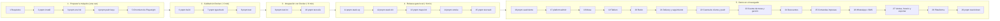

# Munch Mate

Plataforma SaaS multi-restaurante para pedidos por **QR en la mesa**, **retiro** y **delivery**, con tablero de cocina en vivo, seguimiento del pedido en tiempo real, cuentas de cliente con notificaciones push, **mapas propios** para las zonas de reparto y el seguimiento del repartidor, y el **salón**: garzones, cuenta de mesa con propina, descuentos, comandas impresas, ventas exportables y avisos por WhatsApp o SMS.

- Qué hace el producto: [README-PRODUCT.md](README-PRODUCT.md)
- Alcance, modelo de datos y hoja de ruta: [docs/PRODUCT.md](docs/PRODUCT.md)
- Qué falta para producción y qué piden los restaurantes: [docs/PENDIENTES.md](docs/PENDIENTES.md)
- Prueba de delivery con seguimiento, con capturas: [docs/capturas/delivery](docs/capturas/delivery/README.md)
- Stack, reglas y convenciones técnicas: [CLAUDE.MD](CLAUDE.MD)

**Stack:** Next.js · NestJS · Socket.IO · BullMQ + Valkey · MongoDB · Garage (S3) · MapLibre + Protomaps · Caddy · Docker Compose. Todo autoalojado, sin servicios de nube ni proveedor de mapas.

---

## Ruta de pruebas desde cero

Todo lo que hay que hacer, en orden, para dejar el sistema corriendo en tu máquina y probarlo como lo usarían el dueño, la cocina, un repartidor y un cliente.


```mermaid
flowchart LR
  subgraph A["1 · Preparar la máquina (una vez)"]
    direction LR
    s1["1 Requisitos"] --> s2["2 pnpm install"] --> s3["3 pnpm env:init"] --> s4["4 pnpm push:keys"] --> s5["5 Chromium de Playwright"]
  end
  subgraph B["2 · Calidad sin Docker (~2 min)"]
    direction LR
    s6["6 pnpm build"] --> s7["7 pnpm typecheck"] --> s8["8 pnpm test"]
  end
  subgraph C["3 · Integración con Docker (~8 min)"]
    direction LR
    s9["9 pnpm test:int"] --> s10["10 pnpm test:e2e"]
  end
  subgraph D["4 · Release gate local (~8 min)"]
    direction LR
    s11["11 pnpm stack:up"] --> s12["12 pnpm stack:init"] --> s13["13 pnpm maps:init"] --> s14["14 pnpm smoke"] --> s15["15 pnpm test:web"]
  end
  subgraph E["5 · Demo en el navegador"]
    direction LR
    s16["16 pnpm seed:demo"] --> s17["17 platform:admin"] --> s18["18 Mesa"] --> s19["19 Tablero"] --> s20["20 Retiro"] --> s21["21 Delivery y seguimiento"] --> s22["22 Cuenta de cliente y push"]
    s22 --> s23["23 Cuenta de mesa y garzón"] --> s24["24 Descuentos"] --> s25["25 Comandas impresas"] --> s26["26 WhatsApp o SMS"] --> s27["27 Ventas, horario y exportar"] --> s28["28 Plataforma"] --> s29["29 pnpm stack:down"]
  end
  A --> B --> C --> D --> E
```

| Recorrido | Pasos |
| --- | --- |
| **Primera vez** | 1 → 29 |
| **Después de un cambio** | 6 · 7 · 8 · 9 · 10 · 11 · 14 · 15 · 29 |
| **Solo mostrar la demo** | 11 · 13 · 16 → 29 |
| **Cargar datos a mano** | [ver más abajo](#ingreso-manual-de-datos) |
| **Desarrollo diario** | [ver más abajo](#desarrollo-diario) |

> **Windows:** los comandos que ejecutan scripts `sh` (marcados con 🐚: `env:init`, `stack:init`, `infra:init`, `smoke`, `platform:admin`) necesitan **Git Bash**. Si prefieres PowerShell, configura una vez:
> `pnpm config set script-shell "C:\Program Files\Git\bin\bash.exe"`. PowerShell 5.1 tampoco acepta `&&`: ejecuta los comandos uno por línea.

### 1 · Preparar la máquina

<details>
<summary><b>1. Requisitos</b> — Node, pnpm, Docker</summary>

```bash
node -v          # 24 o más nuevo
pnpm -v          # 12.x  (si falta: npm i -g pnpm)
docker version   # Docker Desktop abierto
```

- **Deberías ver:** las tres versiones sin error, y Docker Desktop con «Engine running».
- **Si falla:** abre Docker Desktop y espera a que inicie. Si tienes XAMPP o IIS, detén Apache: el stack necesita los puertos 80 y 443 libres (paso 11).
- **Disco:** el mapa de Chile ocupa ~580 MB en `.maps-cache/` más su copia en Garage (paso 13).
</details>

<details>
<summary><b>2. Dependencias</b> — <code>pnpm install</code></summary>

```bash
pnpm install
```

- **Deberías ver:** «Done in …».
- **Nota:** el aviso de builds bloqueados es normal; el repo aprueba solo los necesarios (argon2, sharp) en `pnpm-workspace.yaml`.
</details>

<details>
<summary><b>3. Archivo .env</b> 🐚 — <code>pnpm env:init</code></summary>

```bash
pnpm env:init
```

- Crea `.env` desde `.env.example` con secretos aleatorios. Se niega a sobrescribir uno existente.
- **Si tu `.env` es anterior a la fase 6**, copia a mano desde `.env.example` las líneas `VAPID_PUBLIC_KEY`, `VAPID_PRIVATE_KEY` y `VAPID_SUBJECT` (vacías) y sigue con el paso 4.
- **Si es anterior a la fase 8**, copia también `MESSAGING_PROVIDER=mailpit`, `TWILIO_ACCOUNT_SID=` y `TWILIO_AUTH_TOKEN=` (los avisos por WhatsApp o SMS llegan a Mailpit en local).
- **Nunca** subas `.env` a git.
</details>

<details>
<summary><b>4. Claves de notificaciones push</b> — <code>pnpm push:keys</code> (opcional)</summary>

```bash
pnpm push:keys
```

- Genera las claves VAPID y las escribe en `.env` solo si están vacías. Sin ellas todo funciona, pero los botones «Avísame» y «Activar avisos» responden que el push no está configurado.
- No las cambies después: rotarlas invalida todas las suscripciones guardadas. Si las agregas con el stack arriba, repite `pnpm stack:up`.
</details>

<details>
<summary><b>5. Navegador de pruebas</b> — Chromium de Playwright</summary>

```bash
pnpm --filter @app/web exec playwright install chromium
```

Descarga Chromium (~150 MB) una sola vez, para las pruebas de la web (paso 15) y las capturas de la guía.
</details>

### 2 · Calidad sin Docker

<details>
<summary><b>6–8. Compilar, tipos y unitarios</b></summary>

```bash
pnpm build
pnpm typecheck
pnpm test
```

- **Deberías ver:** ningún `error TS…`, y utils, workers, web y api en «passed».
- **Si falla:** pnpm se detiene en el primer paquete que falla y los siguientes no se ejecutan. Las líneas con `●` o `✕` dicen qué test falló.
</details>

### 3 · Integración con Docker

<details>
<summary><b>9–10. Integración y API end-to-end</b> — Testcontainers</summary>

```bash
pnpm test:int    # repositorios, colas, comprobante en Garage, email en Mailpit, push
pnpm test:e2e    # todos los endpoints con sesión real y Socket.IO
```

- **Deberías ver:** «Tests: … passed» en api y workers.
- **Si falla:** «Could not find a working container runtime» significa que Docker Desktop no está corriendo. La primera vez descarga las imágenes y tarda más.
</details>

### 4 · Release gate local

Las mismas imágenes que irían al VPS, detrás de Caddy y HTTPS en `https://localhost`.

<details>
<summary><b>11. Levantar el stack</b> — <code>pnpm stack:up</code></summary>

```bash
pnpm infra:down   # solo si tenías el modo desarrollo arriba
pnpm stack:up
```

- **Deberías ver:** los 8 contenedores en «Healthy» (caddy, web, api, workers, mongo, valkey, garage, mailpit), y <https://localhost> con la página de inicio (acepta el certificado local).
- **Si falla:** si ves una página de Apache, XAMPP ocupa los puertos 80/443: detenlo y repite. La primera vez construir la web tarda varios minutos.
</details>

<details>
<summary><b>12. Inicializar Garage</b> 🐚 — <code>pnpm stack:init</code> (solo con volúmenes nuevos)</summary>

```bash
pnpm stack:init
```

Crea el layout de Garage, la llave de la app y los buckets (privado y de fotos). Se puede repetir sin problema: lo que ya existe aparece con «•».
</details>

<details>
<summary><b>13. Mapa de Chile</b> — <code>pnpm maps:init</code> (una vez por volumen)</summary>

```bash
pnpm maps:init
```

- Recorta Chile del mapa mundial de OpenStreetMap (Protomaps) con Docker, baja fuentes e íconos, y sube todo al bucket privado bajo `maps/`. La primera vez descarga ~580 MB y tarda varios minutos; queda en `.maps-cache/` y las siguientes veces solo sube.
- **Deberías ver:** `✓ map ready`. En menos de un minuto `https://localhost/api/public/map-config` responde `"available": true`.
- **Sin este paso** todo funciona, pero sin mapas: las zonas se eligen de una lista y el cliente no ve al repartidor.
</details>

<details>
<summary><b>14. Smoke test</b> 🐚 — <code>pnpm smoke</code></summary>

```bash
pnpm smoke
```

- Recorre el sistema real: salud, TLS, S3, colas, registro, menú, mesa, retiro, delivery, ventas, plataforma, push, mapas y el salón (descuento, cuenta de mesa con propina, exportar CSV y un aviso de WhatsApp en Mailpit).
- **Deberías ver:** `✓ all checks passed`.
- **Si falla:** copia las líneas con `✗`. Registra 1 usuario: si acabas de correr Playwright, espera 1 minuto (límite de 5 registros por minuto).
</details>

<details>
<summary><b>15. Pruebas de la web</b> — <code>pnpm test:web</code></summary>

```bash
# espera ~1 minuto después del smoke
pnpm test:web
pnpm --filter @app/web exec playwright show-report   # si algo falla
```

Playwright maneja un Chromium móvil contra `https://localhost`: cuentas, menú, mesa, retiro, delivery, horario, mapas, seguimiento del repartidor, cancelar con motivo y el salón: descuento, cuenta de mesa cobrada con propina, comanda, CSV de ventas y aviso por WhatsApp (la prueba de mapas se salta sola si falta el paso 13).
</details>

### 5 · Demo en el navegador

<details>
<summary><b>16. Cargar la demo</b> — <code>pnpm seed:demo</code></summary>

```bash
pnpm seed:demo
```

Crea 3 locales con menú, fotos, mesas, retiro, ubicación en el mapa y zonas de delivery dibujadas, usando la API como lo haría un usuario. Imprime un link `/m/…` para pedir desde una mesa de cada local. Se puede repetir: lo que ya existe no se duplica.

**Cuenta:** `demo@munchmate.local` / `munchmate demo 2026`
</details>

<details>
<summary><b>17. Hacerte administrador de plataforma</b> 🐚</summary>

```bash
pnpm platform:admin demo@munchmate.local
pnpm platform:admin --revoke demo@munchmate.local   # para quitarlo
```
</details>

<details>
<summary><b>18–28. Probar cada rol</b></summary>

| # | Rol | Qué hacer | Deberías ver |
| --- | --- | --- | --- |
| 18 | Cliente en la mesa | Abre el link `/m/…` del seed en el teléfono o en incógnito y envía un pedido | `/pedido` con el número grande y «Pendiente» |
| 19 | Dueño / cocina | Entra a <https://localhost/admin> → **Pedidos**, activa el sonido y acepta | El pedido aparece sin recargar; el cliente ve el cambio en vivo |
| 20 | Cliente online | En <https://localhost/r/pizzeria-forno-rosso> pide para **retiro** con un email inventado | Al aceptar: «Listo aprox. a las HH:MM» y el email con el PDF en [Mailpit](http://localhost:8025) |
| 21 | Cliente, dueño y repartidor | **Delivery con seguimiento en vivo**: sigue la [prueba con capturas](docs/capturas/delivery/README.md) | El cliente ve al repartidor moverse en el mapa hasta que marca «Entregado» |
| 22 | Cliente registrado | Crea una cuenta, pide con sesión y abre **Mis pedidos** y **Mi cuenta** (direcciones con pin). En el seguimiento toca **Avísame** | El pedido queda en el historial; el checkout se rellena solo; llega la notificación al quedar listo (requiere el paso 4) |
| 23 | Cliente en la mesa y garzón | Pide dos veces desde la misma mesa, toca **Llamar al garzón** y luego **Mi cuenta** → **Pedir la cuenta** con la propina sugerida. En el panel abre **Salón**: marca **Atendido**, sirve los pedidos y **Cobrar** con el medio de pago | La cuenta suma los pedidos; el salón ve el llamado en vivo con sonido; al cobrar, el teléfono muestra «Cuenta pagada» y **Ventas** muestra la propina aparte |
| 24 | Dueño | **Menú** → editar un producto → **Descuento**: porcentaje o precio especial, días y fechas | En el menú público el precio aparece rebajado con el normal tachado; el pedido se cobra con descuento |
| 25 | Cocina | **Pedidos** → **Impresora**: papel 58 u 80 mm e impresión automática; **Comanda** en cada pedido. En **Salón**, **Precuenta** | Se imprime la comanda (sin precios) o la precuenta con la propina como voluntaria |
| 26 | Cliente online | En la Pizzería pide para retiro marcando **Avísame por WhatsApp** con un celular. Acepta el pedido en el panel | El aviso llega a [Mailpit](http://localhost:8025) como un correo a `569…@whatsapp.mensajes.local` |
| 27 | Dueño / caja | **Ventas** → **Día** (y **Excel · Pedidos/Productos/Por día**), **Rango y exportar** para cualquier periodo, **Imprimir**. En **Resumen** activa **Usar horario** con un tramo que deje el local cerrado | Totales, propinas y descuentos; se descarga un CSV que abre Excel; el menú dice «Cerrado ahora · Abre … a las HH:MM» |
| 28 | Platform admin | Menú del usuario → **Plataforma**, suspende un local y luego reactívalo | Suspendido: su menú público desaparece y el panel queda en solo lectura |
</details>

<details>
<summary><b>29. Apagar</b> — <code>pnpm stack:down</code></summary>

```bash
pnpm stack:down
```

Detiene los contenedores y conserva los datos en los volúmenes (incluido el mapa). Si detuviste XAMPP, ya puedes volver a iniciarlo.
</details>

---

## Ingreso manual de datos

Para cargar un restaurante propio desde cero, sin `seed:demo`. Todo se hace desde el navegador (funciona igual en el teléfono). Ten el stack arriba (pasos 11–13) y [Mailpit](http://localhost:8025) abierto para los correos.

| # | Dónde | Qué hacer | Ejemplo |
| --- | --- | --- | --- |
| 1 | `/registro` | **Crear cuenta** con nombre, correo y contraseña (mínimo 8 caracteres) | Ana Dueña · `ana@local.test` |
| 2 | Mailpit | Abre «Confirma tu correo en Munch Mate» y toca el link. **Sin verificar no puedes crear restaurantes** | — |
| 3 | `/admin` → **Nuevo restaurante** | Nombre del local. La dirección web (`/r/…`) se genera sola y se puede editar | Pizzería Don Pepe |
| 4 | **Resumen** → Perfil público | Descripción, teléfono y logo (**Subir imagen**, se recorta cuadrado) | +56 2 2345 6789 |
| 5 | **Resumen** → Ubicación del local | Toca el mapa donde está el local. Centra los mapas de reparto | — |
| 6 | **Menú** → **Modificadores** | **Crear grupo** con mínimo, máximo y opciones con su valor extra. Primero los grupos: los productos los usan | Tamaño · mín 1 · máx 1 · Mediana $0, Familiar $4.000 |
| 7 | **Menú** → **Productos** | **Nueva categoría**, luego **Crear producto**: nombre, precio, categoría, foto y grupos de opciones. Al editarlo, **Descuento** (opcional): porcentaje o precio especial, días y fechas | Pizzas → Margarita $8.990 + Tamaño · 20 % los martes |
| 8 | **Mesas** | **Agregar mesa** o **Agregar varias mesas**, y **Descargar PDF con todos los QR** para imprimir | Mesa 1 … Mesa 10 |
| 9 | **Resumen** → Retiro en local | Activa **Pedidos para retirar** | — |
| 10 | **Resumen** → Delivery | Activa **Pedidos con delivery** y **Agregar zona** (comuna o sector, costo de envío, pedido mínimo). Marca una como **Zona del local** | Ñuñoa · $1.990 · mínimo $10.000 |
| 11 | **Resumen** → Delivery | En cada zona, **Dibujar en el mapa**: toca los vértices del área y **Guardar área**. Las zonas sin dibujo se eligen por nombre | — |
| 12 | **Resumen** → Horario de atención | **Usar horario**, hasta 2 tramos por día, **Copiar el lunes a todos los días**, **Guardar horario** (opcional) | 12:00–15:30 y 19:00–23:30 |
| 13 | **Equipo** → Invitar a alguien | Correo y roles (Caja, Cocina, Garzón, Repartidor), **Enviar invitación**. La persona acepta desde el correo | `cocina@local.test` · Cocina |
| 14 | **Resumen** → Salón y propina | **Propina sugerida** en % (0 = sin sugerencia). Se ofrece al pedir la cuenta desde la mesa | 10 % |
| 15 | **Resumen** → Avisos por WhatsApp o SMS | **Avisar a los clientes por mensaje**, canal y **Número de envío** del local (registrado en la cuenta de mensajería) | WhatsApp · +569 55550101 |
| 16 | **Pedidos** → **Impresora** | En el dispositivo de cocina: papel y **Imprimir comandas solas**; **Imprimir prueba** | 80 mm · cada pedido nuevo |
| 17 | **Pedidos** | Enciende el interruptor **Recibiendo pedidos**. Sin esto el menú se ve pero no deja pedir | — |
| 18 | `/r/<tu-slug>` y `/m/<código>` | Abre el menú público y el QR de una mesa en incógnito y haz pedidos de prueba | — |

- **Agotado vs. oculto:** en **Menú** → **Disponibilidad** caja y cocina marcan productos u opciones como agotados (se ven, no se piden); ocultar un producto del menú se hace al editarlo.
- **Nombres repetidos:** mesas, zonas, categorías y productos (dentro de su categoría) no pueden repetirse, sin importar mayúsculas ni tildes.
- **Montos:** en pesos, sin decimales ni puntos (`8990`).

---

## Desarrollo diario

Infra en Docker y apps en tu máquina con hot reload. Comparte volúmenes con el stack de producción, pero **no pueden correr a la vez**.

```bash
pnpm stack:down      # si estaba arriba
pnpm infra:up        # mongo, valkey, garage y mailpit en 127.0.0.1
pnpm infra:init      # 🐚 solo con volúmenes nuevos
pnpm maps:init       # solo si el volumen de Garage es nuevo
pnpm dev             # web :3100 · api :3000 · workers
```

## Capturas de la guía

```bash
pnpm capturas:delivery   # con stack:up, maps:init y seed:demo
```

Regenera [docs/capturas/delivery](docs/capturas/delivery/README.md): un recorrido de Playwright con tres teléfonos (cliente, dueño y repartidor) que espera a que cada mapa termine de dibujarse antes de capturar. Deja pedidos en la Pizzería de la demo y no forma parte de `pnpm test:web`.

## Direcciones útiles

| Qué | Stack de producción local | Desarrollo |
| --- | --- | --- |
| App | <https://localhost> | <http://localhost:3100> |
| Panel | <https://localhost/admin> | <http://localhost:3100/admin> |
| Mis pedidos (cliente) | <https://localhost/mis-pedidos> | <http://localhost:3100/mis-pedidos> |
| Mailpit (emails y avisos WhatsApp/SMS) | <http://localhost:8025> | <http://localhost:8025> |
| Plataforma | <https://localhost/plataforma> | <http://localhost:3100/plataforma> |
| Salón (mesas) | <https://localhost/admin> → **Salón** | <http://localhost:3100/admin> → **Salón** |
| Estado del mapa | <https://localhost/api/public/map-config> | <http://localhost:3000/api/public/map-config> |

## Problemas comunes

| Síntoma | Causa | Solución |
| --- | --- | --- |
| Página de Apache en `https://localhost` | XAMPP/IIS ocupa los puertos 80/443 | Detenlo antes de `pnpm stack:up` |
| `sh` no se reconoce / rutas tipo `C:/Program Files/Git/...` | Script `sh` ejecutado desde PowerShell o CMD | Usa Git Bash, o `pnpm config set script-shell` |
| `&&` da error en PowerShell | PowerShell 5.1 no lo soporta | Un comando por línea, o `cmd1; if ($?) { cmd2 }` |
| Errores 429 en smoke o Playwright | Límite de 5 registros por minuto por IP | Espera 1 minuto entre corridas pesadas |
| Conexiones que se cuelgan en Windows | Docker Desktop y `localhost` por IPv6 | Ya está mitigado en los scripts; reinicia Docker Desktop si persiste |
| No aparecen mapas, solo listas de comunas | Falta el mapa en Garage | `pnpm maps:init` y espera un minuto |
| `maps:init`: «Garage is not reachable» | El stack no está arriba | `pnpm stack:up` (o `pnpm infra:up` en desarrollo) y repite |
| «El push no está configurado» | Faltan las claves VAPID | `pnpm push:keys` y vuelve a levantar el stack |
| No aparece «Avísame por WhatsApp» al pedir | El local no activó los avisos, o la plataforma no tiene proveedor (`MESSAGING_PROVIDER=off`) | **Resumen** → Avisos por WhatsApp o SMS; en local el stack ya usa `mailpit` |
| Cada comanda abre la ventana de impresión | Así funciona la impresión desde el navegador | En el dispositivo de cocina abre Chrome con `--kiosk-printing` y deja la térmica como predeterminada |
| «Hay pedidos de esta mesa sin servir» al cobrar | Un pedido de la cuenta sigue en cocina | Márcalo **Servido** (o cancélalo) en **Pedidos** y vuelve a cobrar |
